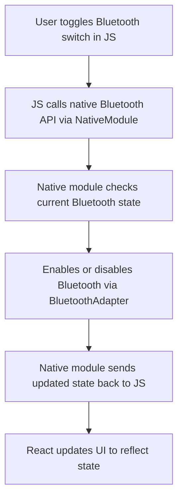
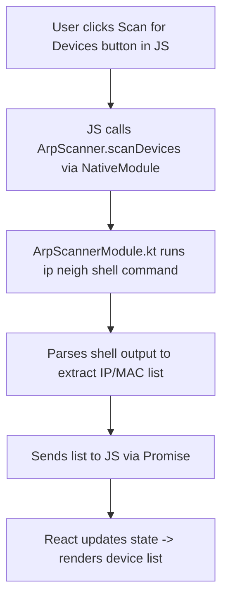

# 🔌 React Native Bluetooth Toggle & Hotspot Device Scanner

This React Native app demonstrates native Android integrations for:

- **Bluetooth Toggle** — Enable/Disable Bluetooth from the app UI.
- **Hotspot Device Scanner** — Scan and display devices connected to the Android mobile hotspot.

Both features use custom native modules integrated into React Native via the `NativeModules` bridge.

---

## 📌 Key Considerations
- Tested On Android Device `Redmi Note 9 | Android Version 10`
- Android 12+ requires additional Bluetooth permissions (`BLUETOOTH_CONNECT`).
- Ensure runtime permissions are requested dynamically on Android 6.0+.
- Not all Android models expose hotspot ARP data — test on various devices.
- iOS has strict limitations on network and Bluetooth control.

---

### 🔹 Bluetooth Toggle



### 🔹 Hotspot Device Scanner



---

## ✅ Platform Support & APIs 

| Feature                | Android | iOS     | Notes                                                                                 |
|------------------------|---------|---------|---------------------------------------------------------------------------------------|
| Bluetooth Toggle       | ✅ Yes  | 🚫 No    | Android uses `BluetoothAdapter`. iOS disallows programmatic toggling of Bluetooth.   |
| Hotspot Device Scanner | ✅ Yes  | 🚫 No   | Android accesses ARP table via shell. iOS restricts access to hotspot connection data.|

---

## 🔐 Permissions Required

### Android

#### 🔹 Bluetooth Toggle
- `android.permission.BLUETOOTH`
- `android.permission.BLUETOOTH_ADMIN`
- `android.permission.BLUETOOTH_CONNECT` *(Android 12+)*
- `android.permission.ACCESS_FINE_LOCATION` *(Required for discovering devices in some cases)*

#### 🔹 Hotspot Scanner
- `android.permission.ACCESS_WIFI_STATE`
- `android.permission.INTERNET`
- `android.permission.ACCESS_NETWORK_STATE`

### iOS

> iOS does not support programmatic Bluetooth toggling or hotspot device scanning.

---

## ⚙️ Project Structure

```
components/
├── BluetoothToggle.js        # Bluetooth toggle component (UI + NativeModule)
├── HotspotScanner.js         # UI to scan and show connected devices

android/
└── app/
    └── src/
        └── main/
            └── java/com/NutaNXT/
                ├── CustomNativePackage.kt      
                └── ArpScannerModule.kt      # Executes shell and parses output
```

---

## 🚀 Setup Instructions

### 2. Install Vector Icons

```bash
npm install react-native-vector-icons
npx react-native link react-native-vector-icons
```

### 3. Run App

```bash
# Start Metro
npx react-native start

# Launch on Android
npx react-native run-android
```

> ⚠️ Use a **real Android device** for full functionality. Emulators don't support Bluetooth or hotspot features.

---

## 📦 Dependencies Used

- `react-native-vector-icons`
- `@react-navigation/native`
- `@react-navigation/bottom-tabs`
- Custom NativeModules (Bluetooth & ARP Scanner)


